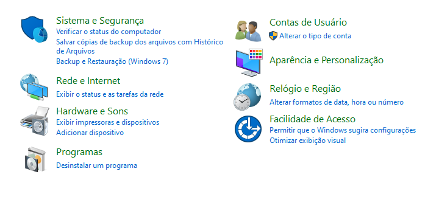
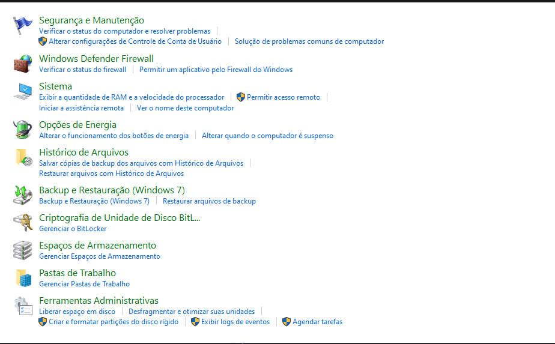
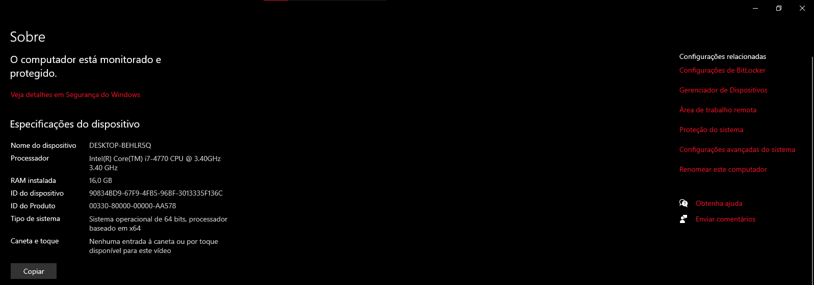
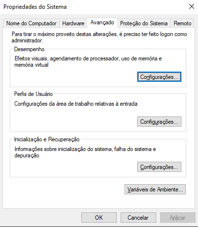

# Configurando o Gettext para Tradução do Projeto

## Instalando dependências

### 1 - Arquivos de Dependência

- [Arquivos de Dependências](https://download.gnome.org/binaries/win32/dependencies/)
- - Acessar o link acima e baixar os arquivos - gettext-runtime-x.x.zip - gettext-tools-x.x.zip
- - _Atualmente a melhor versão é a 0.17_ porque possui todas os arquivos bin necessários.
- - Extraia todos os arquivos

### 2 - Configurando Windows

- Depois de ter extraido os arquivos você precisa seguir esse passos:
- - No Explorador de Arquivos do Windows entrar no caminho seguinte **C:\Program Files**
- - Dentro da **Program Files** você irá criar a pasta **gettext-utils**
- - Dentro da **gettext-utils** criar a pasta **bin**

- A estrutura de pastas será a seguinte

<code>
C:\Program Files\gettext-utils\bin
</code>

- Depois de ter criados as pastas, é necessário entrar nas pastas **gettext-runtime** e **gettext-tools** que você extraiu anteriormente e procurar a pasta bin que elas possuem.
- Dentro desta pasta bin você irar precisar copiar todos os arquivos que estão dentro dela e colar dentro da pasta bin que você criou anteriormente <code>C:\Program Files\gettext-utils\bin</code>

### 3 - Configurando a váriavel de ambiente

- Agora é preciso entrar no Painel de Controle do Windows

- Depois é necessário entrar em Sistema e Segurança

- Depois disso entrar em Sistema e procurar por configurações avançadas do sistema

- Abrirá a seguinte tela

- Nessa tela você precisa entrar em Váriaveis de Ambiente e procurar pelo Path nas Váriaveis do Usuário

- Clique em Editar e depois clicar em Novo.
- Quando você clicar em novo irá abrir um campo para você digitar o caminho de um arquivo, e você irá colocar o caminho da pasta bin que criamos anteriormente <code>C:\Program Files\gettext-utils\bin</code>
- Depois clicar em Ok para sair da tela e clicar em Ok novamente para sair das Váriaveis de Ambiente
- Reinicie sua máquina para o Windows poder carregar todas as alterações que você fez.

### 4 - Configurando o VSCODE

- Dentro de seu projeto Python, procurar por um arquivo chamado settings.py e colocar o seguinte código:

<code>LANGUAGE_CODE = 'en-us'</code>

<code>USE_I18N = True</code>

<code>LOCALE_PATHS = [
os.path.join(BASE_DIR, 'locale'),
]</code>

- Isso irá configurar o seu projeto.
- Depois disso no mesmo nível onde estão seus APPS, criar uma pasta chamada **locale**, dentro da locale criar a pasta **pt_BR**, dentro da pt_BR criar uma pasta chamada **LC_MESSAGES** e dentro da LC_MESSAGES criar o arquivo **django.po**
- Depois disso rodar o seguinte código dentro do terminal do VSCODE <code>django-admin makemessages -l pt-br</code> e depois o código <code>django-admin compilemessages
  </code> isso para com que crie um arquivo chamado **django.mo** que é o arquivo que vai fazer as traduções acontecerem

### 5 - Estrutura para colocar uma nova tradução

- Dentro do seu arquivo **django.po** você vai colocar algo escrever algo mais ou menos assim

<code>#: .\ [app-onde-está-o-elemento-que-você-quer-traduzir] \ [arquivo-onde-está-o-elemento-que-você-quer-traduzir] : [linha-de-codigo-onde-o-elemento-se-encontra]</code>

<code>msgid "[mensagem-que-será-traduzida]"</code>

<code>msgstr "[Tradução-da-mensagem]"</code>

- Depois é necessário você rodar os seguintes códigos no terminal do VSCODE para que as traduções surjam efeito

<code>django-admin makemessages -l pt-br</code> - Irá fazer com que as traduções sejam rastreadas no seu projeto.

<code>django-admin compilemessages</code> - Irá pegar as traduções rastreadas e compilar para dentro do arquivo django.mo

#### **Lembrando que no arquivo que você for traduzir é necessário ter a seguinte importação**

<code> from django.utils.translation import gettext as _ </code> e o elemento que for traduzido precisa estar da seguinte maneira <code>_(elemento) </code>.
